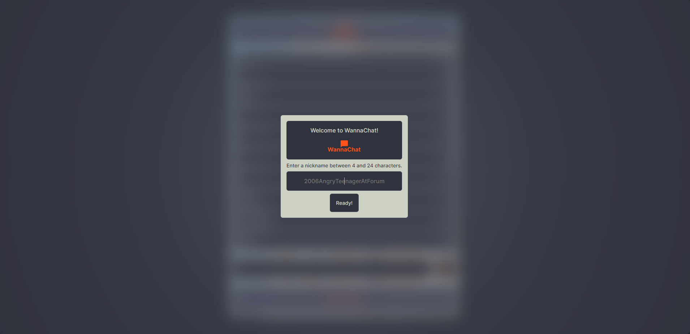
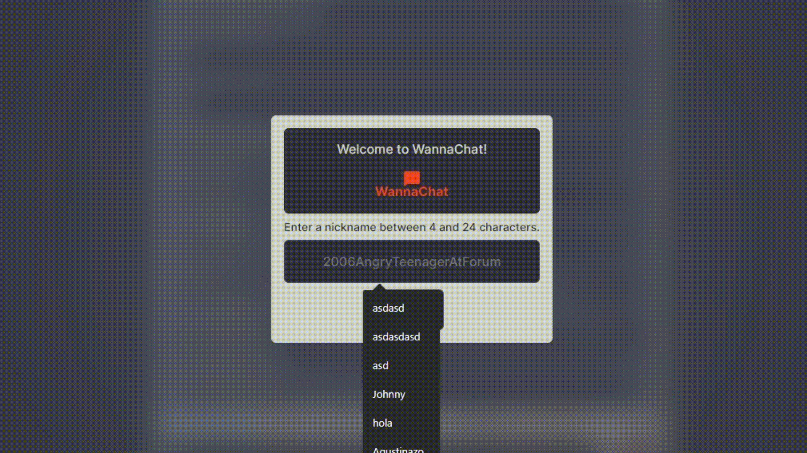
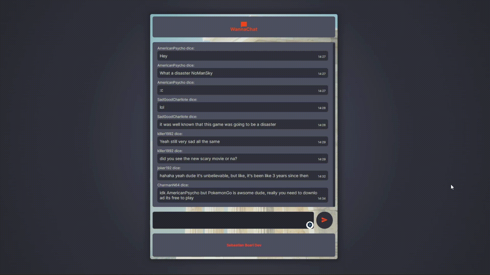

# WannaChat
WannaChat es una aplicación de chat en tiempo real desarrollada como proyecto de práctica para demostrar mis habilidades actuales de desarrollo. Permite a los usuarios comunicarse a través de mensajes de texto utilizando websockets.

### Características principales
- Interfaz de usuario intuitiva y atractiva.
- Comunicación en tiempo real utilizando websockets.
- Validación de mensajes para garantizar que no excedan los 144 caracteres y no estén vacíos.
- Historial de mensajes previos para que los nuevos usuarios puedan ponerse al día.
- Posibilidad de establecer un nombre de usuario único para identificarse en el chat.

### Instalación
1. Clona este repositorio en tu máquina local.
2. Abre una terminal en el directorio raíz del proyecto.
3. Ejecuta el siguiente comando para instalar las dependencias:
`npm install`

### Uso
1. Ejecuta la aplicación con el siguiente comando: 
`npm run dev`
2. Abre tu navegador web e ingresa la siguiente URL: http://localhost:8080.
3. Ingresa un nombre de usuario y comienza a chatear con otros usuarios en tiempo real.`

### Tecnologías utilizadas
1. Node.js
2. Express
3. Socket.io
4. Express Handlebars
5. SASS
6. JavaScript Vanilla ES19

Este proyecto es solo una muestra de mis habilidades y está abierto a mejoras y personalizaciones adicionales. Siéntete libre de explorar el código y adaptarlo según tus necesidades.

¡Disfruta chateando en tiempo real con WannaChat!

------------

*Readme generado por chatGPT*